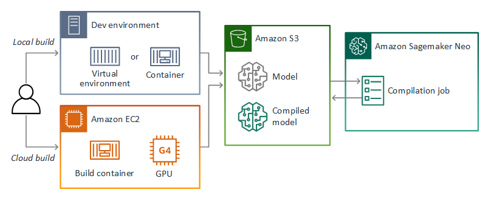

# Export and compile a custom model

Prior to deploying a model in AWS Panorama, you can test it with Amazon Sagemaker Neo to confirm that it compiles. This sample application exports a Keras application model in TensorFlow SavedModel format and compiles it with Sagemaker Neo. You can run it locally in a Python virtual environment or in a Docker container. The sample app can also launch an Amazon EC2 instance to serve as a build environment. It includes basic Panorama application code that you can use to verify the model's functionality on an AWS Panorama Appliance.

The project source includes Python code and supporting resources:

- `code` - Python code that exports a model from Keras, uploads it to Amazon S3, and sends it to Amazon Sagemaker for compilation and packaging.
- `custom-model.yml` - An AWS CloudFormation template that creates an AWS Lambda function and a service role for Amazon Sagemaker.
- `ec2-instance.yml` - A template that launches an Amazon EC2 instance configured for use as a development environment.
- `01-create-bucket.sh`, `02-deploy.sh`, etc. - Shell scripts that use the AWS CLI to deploy and manage the application.

Use the following instructions to deploy the sample application.

# Requirements

This project uses the following software.

- The Bash shell. For Linux and macOS, this is included by default. In Windows 10, you can install the [Windows Subsystem for Linux](https://docs.microsoft.com/en-us/windows/wsl/install-win10) to get a Windows-integrated version of Ubuntu and Bash.
- [The AWS CLI](https://docs.aws.amazon.com/cli/latest/userguide/cli-chap-install.html) v1.17 or newer.
- [Python 3.6](https://www.python.org/downloads/) (optional)
- [TensorFlow 2.2.0](https://www.tensorflow.org/install) (optional)
- [Docker 19.03](https://docs.docker.com/get-docker/) (optional)

The project provides options for exporting models locally in a Python virtual environment or Docker container, or in Amazon EC2 on an instance that comes with Docker and TensorFlow configured for GPU access.

# Setup

Download or clone this repository.

    $ git clone https://github.com/awsdocs/aws-panorama-developer-guide.git
    $ cd aws-panorama-developer-guide/sample-apps/custom-model

To create a new bucket for models and deployment artifacts, run `01-create-bucket.sh`.

    custom-model$ ./01-create-bucket.sh
    make_bucket: aws-panorama-artifacts-a5e4xmplb5b22e0d
    
To deploy the application code and IAM roles, run `02-deploy.sh`.

    custom-model$ ./02-deploy.sh
    Successfully packaged artifacts and wrote output template to file out.yml.
    Waiting for changeset to be created..
    Waiting for stack create/update to complete
    Successfully created/updated stack - custom-model

This script uses AWS CloudFormation to create AWS resources, which are defined in the template [custom-model.yml](custom-model.yml). If the CloudFormation stack that contains the resources already exists, the script updates it with any changes to the template or function code.

If you prefer to compile the project code in Amazon EC2 or on a device, run `03-upload-project.sh`. This uploads the contents of the project folder to the project bucket.

    custom-model$ ./03-upload-project.sh
    upload: code/keras-model.py to s3://aws-panorama-artifacts-a5e4xmplb5b22e0d/custom-model/code/keras-model.py
    upload: code/model.test.py to s3://aws-panorama-artifacts-a5e4xmplb5b22e0d/custom-model/code/model.test.py
    upload: code/requirements.txt to s3://aws-panorama-artifacts-a5e4xmplb5b22e0d/custom-model/code/requirements.txt
    upload: code/application.py to s3://aws-panorama-artifacts-a5e4xmplb5b22e0d/custom-model/code/application.py
    upload: code/model/model.py to s3://aws-panorama-artifacts-a5e4xmplb5b22e0d/custom-model/code/model/model.py
    ...

# Build locally in a Python virtual environment

To create a virtual environment with the Python libraries used by the sample app, run `11-install-pipenv.sh`. Pipenv creates a virtual environment with the libraries defined in `Pipfile`. You can activate the environment by running `pipenv shell`, or run single commands with `pipenv run <command>`. 

    custom-model$ ./11-install-pipenv.sh

To compile the model, run `12-compile-model.sh`.

    custom-model$ ./12-compile-model.sh

This script runs the code in [code/keras-model.py](code/keras-model.py), which loads a trained model from Keras and saves it in TensorFlow `SavedModel` format. It then compiles the model with SageMaker Neo to run on Xavier devices. The exported model and compiled model are saved in the project bucket.

If you see warnings from TensorFlow about GPU access, you might need to install CUDA drivers or configure other software in your operating system. You can still export a model without access to a GPU. For a development environment that comes with TensorFlow, Docker, and GPU access enabled, continue to **Build in Amazon EC2**.

# Build locally in a Docker container

If you have Docker installed, you can build a container that runs the application. The project includes a Dockerfile that uses the NVIDIA TensorFlow Docker image as a base. 

The Dockerfile specifies a default region for the AWS SDK in an environment variable. Update this to use the region where you deployed the application.

    # syntax=docker/dockerfile:1
    FROM nvcr.io/nvidia/tensorflow:20.06-tf2-py3
    WORKDIR /app
    ENV AWS_DEFAULT_REGION=us-west-2

To build the container, run `21-build-container.sh`.

    custom-model$ ./21-build-container.sh

To run the container, use `22-run-container.sh`

    custom-model$ ./22-build-container.sh

To run the container interactively for exploration or debug, use `23-open-container.sh`.

    custom-model$ ./23-open-container.sh

This script opens a terminal session inside the container. From within the container, you can run the application with `python /app/code/keras-model.py`. The project directory is also mapped to `/workspace`. 

# Build in Amazon EC2

To run the project in Amazon EC2, first sign up for a subscription to the NVIDIA Deep Learning AMI. The subscription is required to launch an instance with the AMI. It doesn't incur additional costs beyond standard EC2 instance charges.

    https://aws.amazon.com/marketplace/server/configuration?productId=46a68101-e56b-41cd-8e32-631ac6e5d02b

Next, create a keypair that you use to connect to the instance with SSH.

    custom-model$ ./31-create-keypair.sh

To launch an instance, run `32-launch-instance.sh`. This script uses the CloudFormation template [ec2-instance](ec2-instance.yml) to create an instance, IAM role, and instance profile. It also attaches an Amazon EBS volume to increase the instance's storage, as the Docker images used are quite large.

    custom-model$ ./32-launch-instance.sh

When the instance finishes provisioning, connect to it with `33-ssh-connect.sh`. Note the AWS CLI command that the script outputs before it opens the SSH connection. You will use this to copy the project files to the instance from Amazon S3.

    custom-model$ ./33-ssh-connect.sh

Run the `aws s3 sync` command shown output by the previous command to copy the project files onto the instance. Enter the project folder, and run `chmod` to make the scripts executable.

    ~$ aws s3 sync s3://aws-panorama-artifacts-a5e4xmplb5b22e0d/custom-model custom-model
    ~$ cd custom-model
    custom-model$ chmod 755 *.sh

 The project includes a Dockerfile that uses the NVIDIA TensorFlow Docker image as a base. To build it, run `21-build-container.sh`.

    custom-model$ ./21-build-container.sh

To run the container, use `22-run-container.sh`

    custom-model$ ./22-build-container.sh

To run the container interactively for exploration or debug, use `23-open-container.sh`.

    custom-model$ ./23-open-container.sh

This script opens a terminal session inside the container. From within the container, you can run the application with `python /app/code/keras-model.py`. The project directory is also mapped to `/workspace`. 

# Try a different model

By default, the sample application uses the trained DenseNet121 model from `tf.keras.applications`. You can use a different model by running the application with the model name as an argument. Within your virtual environment or container, run the following command to compile `ResNet50V2`.

    (virtual environment)
    custom-model$ pipenv run python3 code/keras-model.py ResNet50V2

    (container)
    /app# python3 keras-model.py ResNet50V2

To get a list of available models, open a Python interpreter and run the following commands.

    custom-model$ python3
    >>> import tensorflow as tf
    >>> from inspect import getmembers, isfunction
    >>> [model[0] for model in getmembers(tf.keras.applications, isfunction)]
    ['DenseNet121', 'DenseNet169', 'DenseNet201', 'InceptionResNetV2', 'InceptionV3', 'MobileNet', 'MobileNetV2', 'NASNetLarge', 'NASNetMobile', 'ResNet101', 'ResNet101V2', 'ResNet152', 'ResNet152V2', 'ResNet50', 'ResNet50V2', 'VGG16', 'VGG19', 'Xception']

# Deploy AWS Panorama application

After confirming that the model compiles, you can deploy it to an AWS Panorama Appliance. Sample code for the model is available in `code/application.py`. The CloudFormation template that you deployed earlier created a Lambda function with this code that is ready to import into AWS Panorama. To get the function name, model name, and the URI of the model in Amazon S3, run `41-get-configuration.sh`

    custom-model$ ./41-get-configuration.sh
    FUNCTION NAME
    panorama-custom-model-function-nL4cxmplsIIi
    MODEL NAME
    custom-model
    MODEL OBJECT URI
    s3://aws-panorama-artifacts-a5e4xmplb5b22e0d/models/DenseNet121-tf220.tar.gz

Use these details to create an application in the AWS Panorama console and deploy it to your appliance. For instructions, see [Deploying an application](https://docs.aws.amazon.com/panorama/latest/dev/gettingstarted-deploy.html#gettingstarted-deploy-create).

# Cleanup

To clean up project resources, run the cleanup scripts in order.

    custom-model$ ./95-delete-pipenv.sh
    custom-model$ ./96-delete-instance.sh
    custom-model$ ./97-delete-keypair.sh
    custom-model$ ./98-delete-resources.sh
    custom-model$ ./99-delete-bucket.sh